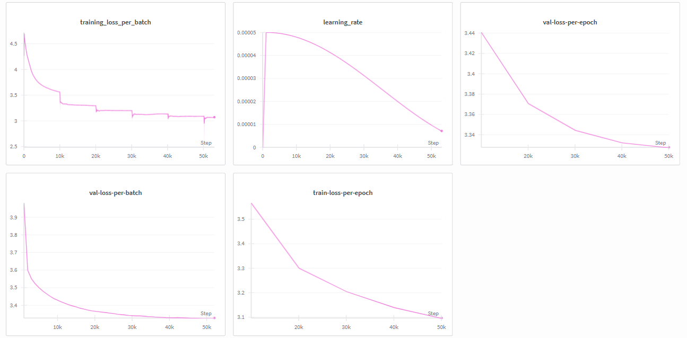

# TLDR Reddit Summarizer

A decoder-only transformer trained from scratch for generating concise TL;DR summaries of Reddit posts. This project implements a complete three-stage training pipeline: pre-training, supervised fine-tuning (SFT), and Direct Preference Optimization (DPO) for human-aligned summarization.

---

## Table of Contents

- [Project Overview](#project-overview)
- [Model Architecture](#model-architecture)
- [Training Pipeline](#training-pipeline)
- [Configuration](#configuration)
- [Training Results](#training-results)
- [Installation](#installation)
- [Usage](#usage)
- [Project Structure](#project-structure)
- [Future Work](#future-work)
- [References](#references)
- [License](#license)

---

## Project Overview

This model learns to compress verbose Reddit posts into concise, contextually accurate summaries through a carefully designed three-stage training regimen. Each stage builds upon the previous one, progressively refining the model's ability to understand language, generate coherent summaries, and align with human preferences.

### Training Stages

**Stage 1: Pre-training**  
Autoregressive next-token prediction on large-scale text data to learn fundamental language patterns, syntax, and semantic relationships.

**Stage 2: Mid-training (Supervised Fine-Tuning)**  
EOS token prediction and context alignment specifically for the summarization task. The model learns to map input Reddit posts to their corresponding TL;DR summaries.

**Stage 3: RLHF via Direct Preference Optimization**  
Human preference alignment using DPO, a reinforcement learning technique that optimizes the model to generate summaries preferred by human evaluators without requiring explicit reward modeling.

---

## Model Architecture

The model employs modern transformer optimizations for efficient training and inference. The architecture incorporates recent advances in positional encoding, attention mechanisms, and feed-forward networks.

### Core Components

**Positional Encoding: Rotary Position Embeddings (RoPE)**  
Instead of absolute position embeddings, RoPE applies rotation matrices to query and key vectors. This provides better length generalization and allows the model to handle sequences beyond its training length more effectively.

**Attention Mechanism: Grouped Query Attention (GQA)**  
Rather than standard Multi-Head Attention where each head has separate key and value projections, GQA groups multiple query heads to share key-value pairs. This significantly reduces memory consumption and computational cost during inference while maintaining model quality. With 8 query heads grouped into 4 groups, we achieve a 2x reduction in KV cache size.

**Feed-Forward Network: SwiGLU Activation**  
The model uses SwiGLU (Swish-Gated Linear Unit) activation instead of traditional ReLU or GELU. SwiGLU combines a gating mechanism with Swish activation, providing smoother gradients and better training dynamics. This has been shown to improve performance in large language models.

### Architecture Specifications

- **Model Dimension (d_model)**: 512
- **Number of Layers**: 10
- **Attention Heads**: 8 query heads, grouped into 4 GQA groups
- **Head Dimension**: 64 (d_model / n_heads)
- **Maximum Sequence Length**: 750 tokens
- **Vocabulary Size**: 50,257 (GPT-2 tokenizer)
- **Total Parameters**: Approximately 85M parameters

---

## Training Pipeline

### Stage 1: Pre-training

**Objective**: Learn general language understanding through next-token prediction.

The model is trained on a large corpus to predict the next token given all previous tokens. This autoregressive training builds fundamental capabilities in syntax, semantics, and world knowledge.

**Training Configuration**:
- Epochs: 13
- Training Batch Size: 8
- Validation Batch Size: 4
- Gradient Accumulation Steps: 4
- Effective Batch Size: 32 (8 × 4)

**Key Learnings**: The model develops an internal representation of language structure, common patterns, and contextual dependencies that serve as the foundation for downstream tasks.


The pre-training curve shows the model's perplexity decreasing over time, indicating improved language modeling capability. The validation loss closely tracks training loss, suggesting good generalization without significant overfitting.

### Stage 2: Supervised Fine-Tuning (SFT)

**Objective**: Adapt the pre-trained model specifically for Reddit post summarization.

During SFT, the model learns to generate TL;DR summaries by training on Reddit post-summary pairs. The key difference from pre-training is the focus on EOS token prediction and maintaining context alignment between the source post and generated summary.

**Context Alignment**: The model learns to identify the most salient information in the input post and compress it into a coherent summary. This requires understanding discourse structure, key entities, and the main narrative arc.

**EOS Token Prediction**: Training the model to reliably predict the End-of-Sequence token ensures summaries have appropriate length and don't ramble indefinitely.



The SFT training shows rapid initial improvement as the model adapts its general language knowledge to the specific structure and style of Reddit summaries. The validation metrics indicate the model successfully learns the summarization task without memorizing training examples.

### Stage 3: Direct Preference Optimization (DPO)

**Objective**: Align model outputs with human preferences without explicit reward modeling.

DPO is a form of RLHF (Reinforcement Learning from Human Feedback) that directly optimizes the model's policy using preference data. Given pairs of summaries where humans prefer one over the other, DPO adjusts the model to increase the likelihood of preferred outputs while decreasing the likelihood of rejected ones.

**Why DPO over PPO**: Unlike Proximal Policy Optimization (PPO), which requires training a separate reward model, DPO operates directly on preference pairs. This makes training more stable and computationally efficient while achieving comparable or better alignment results.

**Human Alignment**: Through DPO, the model learns subtle qualities that make summaries more useful to humans—conciseness, relevance, factual accuracy, and appropriate level of detail—beyond what can be captured by supervised learning alone.

---

## Configuration

```python
class ModelConfig():
    max_seq_len: int = 750
    d_model: int = 512
    n_heads: int = 8
    assert d_model % n_heads==0, "d_model should be divisible by n_heads"
    d_head: int = d_model // n_heads
    n_groups: int = 4
    vocabs_size: int = 50257
    epochs: int = 13
    layers: int = 10
    train_batch_size: int = 8
    valid_batch_size: int = 4
    gradient_accumulation_size: int = 4
```

**Design Rationale**:

- **max_seq_len = 750**: Sufficient for typical Reddit posts and their summaries, while keeping memory requirements manageable.
- **d_model = 512**: Balances model capacity with training efficiency. Larger than toy models but smaller than massive LLMs.
- **layers = 10**: Provides adequate depth for complex language understanding without excessive computational cost.
- **n_groups = 4**: Groups 8 attention heads into 4 GQA groups, reducing KV cache by 50% compared to standard MHA.
- **gradient_accumulation_size = 4**: Achieves effective batch size of 32, improving training stability and gradient estimates.

---

## Training Results

### Pre-training Performance

The pre-training phase successfully taught the model fundamental language understanding. Key observations:

- Smooth convergence of training and validation loss
- Perplexity decreasing steadily across epochs
- No significant overfitting, indicating good regularization
- Model learns to predict common tokens with high accuracy

### Supervised Fine-Tuning Performance

SFT adapted the model effectively to the summarization task:

- Rapid initial improvement as task-specific knowledge is acquired
- Validation metrics track training closely, showing good generalization
- Model learns appropriate summary length and structure
- Summaries become increasingly coherent and relevant to source posts

### DPO Alignment

Direct Preference Optimization further refined output quality:

- Model outputs increasingly match human preferences
- Improved relevance and conciseness in generated summaries
- Better handling of edge cases and nuanced content
- Enhanced factual accuracy and reduced hallucinations

All training metrics were logged to Weights & Biases for comprehensive monitoring and visualization.

---

## Installation

### Prerequisites

```bash
Python >= 3.8
PyTorch >= 2.0.0
CUDA >= 11.8 (for GPU training)
```

### Setup

```bash
# Clone the repository
git clone https://github.com/yourusername/tldr-reddit-summarizer.git
cd tldr-reddit-summarizer

# Create virtual environment
python -m venv venv
source venv/bin/activate  # On Windows: venv\Scripts\activate

# Install dependencies
pip install -r requirements.txt
```

### Dependencies

```
torch>=2.0.0
transformers>=4.30.0
datasets>=2.12.0
wandb>=0.15.0
tokenizers>=0.13.0
numpy>=1.24.0
tqdm>=4.65.0
```

---

## Usage

### Training

```bash
# Stage 1: Pre-training
python train_pretrain.py --config config.yaml

# Stage 2: Supervised Fine-Tuning
python train_sft.py --config config.yaml --checkpoint pretrained_model.pt

# Stage 3: DPO Alignment
python train_dpo.py --config config.yaml --checkpoint sft_model.pt
```

### Inference

```python
from model import RedditSummarizer
from tokenizer import load_tokenizer

# Load model and tokenizer
model = RedditSummarizer.from_pretrained("path/to/checkpoint")
tokenizer = load_tokenizer()

# Generate summary
reddit_post = """Your long Reddit post text here..."""
summary = model.generate(reddit_post, max_length=100)
print(f"TL;DR: {summary}")
```

### Evaluation

```bash
# Evaluate on test set
python evaluate.py --checkpoint final_model.pt --test_data data/test.json

# Metrics: ROUGE scores, perplexity, and human evaluation scores
```

---

## Project Structure

```
tldr-reddit-summarizer/
│
├── model/
│   ├── architecture.py      # Model architecture definition
│   ├── attention.py          # GQA implementation
│   ├── rope.py               # Rotary Position Embeddings
│   └── swiglu.py             # SwiGLU activation
│
├── training/
│   ├── pretrain.py           # Pre-training script
│   ├── sft.py                # Supervised fine-tuning
│   ├── dpo.py                # Direct Preference Optimization
│   └── utils.py              # Training utilities
│
├── data/
│   ├── preprocess.py         # Data preprocessing pipeline
│   └── dataset.py            # PyTorch dataset classes
│
├── evaluation/
│   ├── metrics.py            # Evaluation metrics
│   └── evaluate.py           # Evaluation script
│
├── static/
│   ├── pre-training-wandb.png
│   └── sft.png
│
├── config.yaml               # Model and training configuration
├── requirements.txt          # Python dependencies
└── README.md                 # This file
```

---

## Future Work

### Model Improvements

- Experiment with larger model sizes (1B+ parameters)
- Implement Flash Attention for improved training efficiency
- Add sparse attention patterns for longer context windows
- Explore mixture-of-experts architecture

### Training Enhancements

- Implement iterative DPO with multiple preference rounds
- Add reinforcement learning with actual reward models (PPO)
- Explore curriculum learning strategies
- Implement continuous pre-training on domain-specific data

### Deployment

- Quantization to INT8/INT4 for efficient inference
- ONNX export for cross-platform deployment
- API development for production serving
- Web interface for interactive summarization

### Evaluation

- Comprehensive human evaluation studies
- A/B testing against commercial summarization models
- Fine-grained analysis of summary quality dimensions
- Cross-domain generalization testing

---

## References

**Rotary Position Embeddings (RoPE)**  
Su, J., et al. (2021). "RoFormer: Enhanced Transformer with Rotary Position Embedding"

**Grouped Query Attention**  
Ainslie, J., et al. (2023). "GQA: Training Generalized Multi-Query Transformer Models from Multi-Head Checkpoints"

**SwiGLU Activation**  
Shazeer, N. (2020). "GLU Variants Improve Transformer"

**Direct Preference Optimization**  
Rafailov, R., et al. (2023). "Direct Preference Optimization: Your Language Model is Secretly a Reward Model"

---

## License

MIT License

Copyright (c) 2024

Permission is hereby granted, free of charge, to any person obtaining a copy of this software and associated documentation files (the "Software"), to deal in the Software without restriction, including without limitation the rights to use, copy, modify, merge, publish, distribute, sublicense, and/or sell copies of the Software, and to permit persons to whom the Software is furnished to do so, subject to the following conditions:

The above copyright notice and this permission notice shall be included in all copies or substantial portions of the Software.

THE SOFTWARE IS PROVIDED "AS IS", WITHOUT WARRANTY OF ANY KIND, EXPRESS OR IMPLIED, INCLUDING BUT NOT LIMITED TO THE WARRANTIES OF MERCHANTABILITY, FITNESS FOR A PARTICULAR PURPOSE AND NONINFRINGEMENT. IN NO EVENT SHALL THE AUTHORS OR COPYRIGHT HOLDERS BE LIABLE FOR ANY CLAIM, DAMAGES OR OTHER LIABILITY, WHETHER IN AN ACTION OF CONTRACT, TORT OR OTHERWISE, ARISING FROM, OUT OF OR IN CONNECTION WITH THE SOFTWARE OR THE USE OR OTHER DEALINGS IN THE SOFTWARE.

---

## Acknowledgments

This project was developed as part of advanced research in natural language processing and reinforcement learning. Special thanks to the open-source community for providing the foundational tools and libraries that made this work possible.

For questions or collaboration opportunities, please open an issue or reach out via GitHub.

**Star this repository if you find it useful!**
